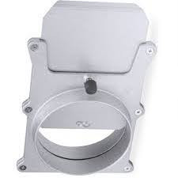

# Blast-Gates
Schieberanordnung für Absauganlage

Die letzte geplante Variante konnte leider nicht realisiert werden - ein alternativ Vorschlag wurde erarbeitet.
 
Die Arbeiten wurden jetzt vollständig vom 'Dream-Team' übernommen und das Konzept wurde wie folgt geändert:
  
Zum Einsatz kommt eine 'Distribution Box' aus Holz mit 6 Öffnungen, wobei die obere Öffnung eine Plexiglasscheibe sein wird, durch die man ins Innere schauen und ggf. zur Reinigung öffnen kann.

  

Eine Öffnung wird an die Absaugeinrichtung angschlossen, jeweils eine von 4 Öffnungen gehen an die Formatkreissäge, die Bandsäge, den Abrichthobel und die letzte Öffnung ist für einen Handabsaugschlauch vorgesehen.

  

Um die Saugkraft für die jeweils gerade genutzte Maschine zu optimieren, wurde die Idee der 'Blast-Gates' geboren.  5 Schieber geben dabei jeweils den benötigten Saugkanal frei.
